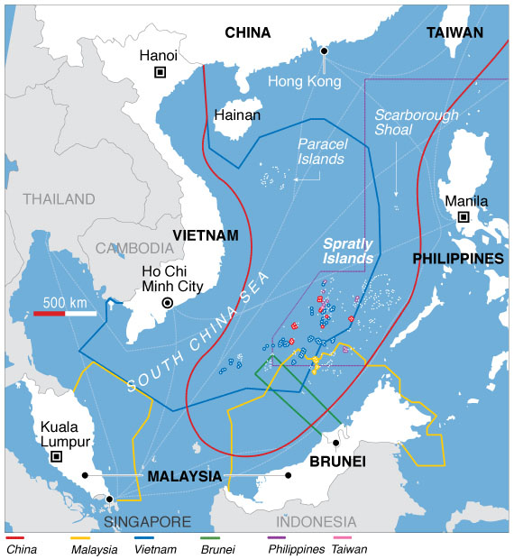

{ height=95% }

\clearpage

# Ein Überblick über die bisherige Lage

## Geschichtliches und alte Verträge

Die Inseln im Südchinesische Meer waren die längste Zeit unbewohnt und 
obwohl es alte chinesische Aufzeichnungen über sie gibt und altertümliche chinesische
Objekte in der Gegend gefunden wurden, beginnt die Geschichte des Konfliktes erst nach dem
zweiten Weltkrieg. Hierbei geht es vor allem um zwei Inselgruppen, die Paracel Inseln,
die im Norden liegen und von China, Vietnam und Taiwan beansprucht werden, sowied ie Spratly Inseln, die im Süden liegen und von Brunei, den Philippinen und Malaysia beansprucht werden.

Nach Vietnams Auffassung sind die Paracel Inseln Teil ihres Territoriums, da sie wie
Vietnam unter französischer Kolonialherrschaft standen. Außerdem wurden diese von Frankreich
nach dem Ende des zweiten Weltkrieges auch an Vietnam zurückgegeben. 
Die zuerst friedliche Aufteilung der Inseln begann um 1970. Das bisher einzige Gefecht
gab es 1974 als China die Paracel Inseln unter seine Kontrolle brachte, 
die sie auch immer noch besitzen.

Ab 1990 gab es multilaterale Gespräche zwischen Mitgliedern von ASEAN (dem Verband 
Südostasiatischer Nationen), da bilaterale Gespräche schnell zu Spannungen
mit den nicht an den Gesprächen beteiligten Nationen führen könnten und
außerdem Chinas Machtposition stärken würden. China erklärte, dass es an der 
Beilegung des Konfliktes interessiert sei, allerdings bilaterale Gespräche vorziehen würde.
Außerdem behielt es trotz Beteuerungen eine aggressive Außenpolitik bei und nahm zum Beispiel
1994 das Meiji Jiao Atoll, das Teil der Spratly Inseln ist, ein.

Jedes Land besitzt laut dem Seerechtsübereinkommen der Vereinten Nationen von 1994 eine 
Ausschließliche Wirtschaftszone von 370 km um seine Küsten herum,
in der es unbeschränkt Ressourcen ausbeuten darf.
Dieses gilt auch für bewohnbare Inseln, nicht aber für Felsen.
Probleme ergeben sich daher vor allem aus überschneidenden Zonen, wie sie in der Gegend
(siehe Karte auf dem Deckblatt) existieren. Hierbei beansprucht China aber nach der 
Neun-Striche-Linie ein Areal, dass sie versuchen mit historischen Argumenten zu stützen.
Der Ständige Schiedshof in Den Haag entschied 2016 jedoch das China keinen 
legitimen Anspruch auf dieses Gebiet besitzt. Peking erkennt das Urteil nicht an.

## Strategische Machtinteressen
 
Nach der Auffassung der Volksrepublik China, welche beinhaltet, dass die 
Inselgruppen im Südchinesischen Meer vollständig zum chinesischem Hoheitsgebiet 
gehören, hat die Selbige das Recht, nach dem UN-Seerechtsübereinkommen, das 
Territorium im Umkreis von 200 Meilen um besagte Inselgruppen zu kontrollieren. 
Dies bedeutet, dass die VR. China einen Anspruch auf zirka 90 Prozent des 
Südchinesischen Meers erhebt. Selbiges ist die wichtigste Seetransportroute der 
Welt, gerundet 50 Prozent aller verschifften Waren werden durch jenes Gebiet 
transportiert, eine Kontrolle dieses Gebietes durch ein einziges Land würde eine 
enorme Machtstellung über den Handel in diesem Gebiet bedeuten. Davon 
abgesehen umfasst    das Territorium geschätzt 30 Millionen Barrel Erdöl, sowie 
7500km³ Erdgas und angeblich auch Mineralvorkommen. Die VR. China kontrolliert 
nach momentanen Gebietsansprüchen nicht genügend Vorkommen um sich selbst 
zu versorgen, die Vorkommen im Südchinesischen Meer würden jedoch ausreichen 
um eine zeitweise Unabhängigkeit von Drittquellen zu gewährleisten. Des weiteren 
ist die VR. China das Land mit dem weltweit größten Fischkonsum, auch hier 
genügen die Gebiete welche der VR. China zugeschrieben werden nicht um das 
Land vollständig zu versorgen, daher ist man dort momentan auf Fischexporte von 
Vietnam angewiesen. Diese Umstände lassen erkennen, dass eine Kontrolle der VR.
China über Großteile dieses Gebietes einen enormen Anstieg der wirtschaftlichen 
Macht derselbigen bedeutet. Für die anderen beteiligten Parteien wäre dies ein sehr 
unangenehmer Umstand, da dies nicht nur einen Rückgang ihrer Wirtschaftsmacht 
sondern auch eine höhere Abhängigkeit von der VR. China bedeuten würde. Somit 
wäre die ökonomische Machtzunahme der VR. China enorm, jedoch ist dies nicht der
einzige Bereich der von diesem Konflikt betroffen ist. Auch die Strategische 
Bedeutung ist nicht zu unterschätzen. Momentan expandiert die Chinesische Marine 
ihr Einflussgebiet durch die Blockade anderer kleiner Inseln im Südchinesischen 
Meer. Zudem gibt es Pläne einer Kontrolle des Luftraums über dem Territorium. 
Beide Vorgänge werden von den unmittelbar beteiligten Parteien, sowie deren 
Verbündete (z.B. die USA) und anderen Dritten kritisiert, insgesamt appellieren jene 
zu einer friedlichen und diplomatischen Lösung, die VR. China jedoch bleibt bisher 
bei ihrem Standpunkt, dass die Zugehörigkeit der Inselgruppen zu dem chinesischen 
Hoheitsgebiet nicht verhandelbar ist, auch über einen Gerichtsbeschluss, in welchem
die Ansprüche auf Philippinisches Territorium als unrecht beschlossen wurden setzte 
sich China hinweg.

## Neuere Entwicklungen (Trump, Duterte)

# Wie wird sich das entwickeln?

# Mögliche Lösungen

# Quellen 

 - Geschichtliches und alte Verträge, alle zuletzt am 28.2 aufgerufen.
    - http://blogs.reuters.com/great-debate/2015/06/09/everything-you-need-to-know-about-the-south-china-sea-conflict-in-under-five-minutes/
    - https://de.wikipedia.org/wiki/ASEAN
    - https://de.wikipedia.org/wiki/Seerechts%C3%BCbereinkommen
    - https://de.wikipedia.org/wiki/Terumbu_Semarang_Barat_Kecil
    - https://de.wikipedia.org/wiki/Vietnam
    - https://en.wikipedia.org/wiki/Mischief_Reef
    - https://en.wikipedia.org/wiki/Nine-Dash_Line
    - https://en.wikipedia.org/wiki/Philippines_v._China
    - https://en.wikipedia.org/wiki/Territorial_disputes_in_the_South_China_Sea
    - https://en.wikipedia.org/wiki/United_Nations_Convention_on_the_Law_of_the_Sea
    - http://www.essay.uk.com/essays/history/essay-the-south-china-sea-conflict/
    - http://www.zeit.de/politik/ausland/2016-07/china-hat-keinen-gebietsanspruch-auf-inseln-im-suedchinesischen-meer
    - http://www.zeit.de/politik/ausland/2016-07/china-philippinen-den-haag-schiedshof-suedchinesisches-meer

 - Strategische Machtinteressen
    - Arte Doku, Inselkrieg im Chinesischen Meer oder warum unsere Zivilisation am Ende ist
      https://www.youtube.com/watch?v=X8aNyS745y4&t=55s
    - https://en.wikipedia.org/wiki/South_China_Sea
    - Vox,  Why China is building islands in the South China Sea 
      https://www.youtube.com/watch?v=luTPMHC7zHY
